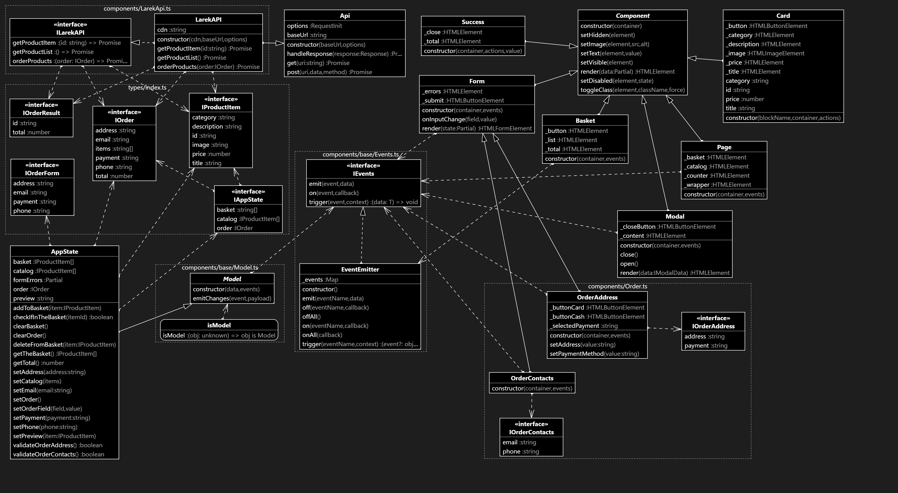

# Проектная работа "Веб-ларек"

Стек: HTML, SCSS, TS, Webpack

Структура проекта:
- src/ — исходные файлы проекта
- src/components/ — папка с JS компонентами
- src/components/base/ — папка с базовым кодом

Важные файлы:
- src/pages/index.html — HTML-файл главной страницы
- src/types/index.ts — файл с типами
- src/index.ts — точка входа приложения
- src/styles/styles.scss — корневой файл стилей
- src/utils/constants.ts — файл с константами
- src/utils/utils.ts — файл с утилитами

## Установка и запуск
Для установки и запуска проекта необходимо выполнить команды

```
npm install
npm run start
```

или

```
yarn
yarn start
```
## Сборка

```
npm run build
```

или

```
yarn build
```

# UML-схема



# Интерфейсы

Основные интерфейсы и типы описаны в types/index.ts:

***Интерфейс для одного товара:***
```
interface IProductItem {
  id: string, // айди товара
  description: string, // описание товара
  image: string, // картинка товара
  title: string, // название товара
  category: string, // категория
  price: number | null, // цена
}
```
***Интерфейс для заказа:***
```
interface IOrder {
  payment: string, // метод оплаты
  email: string, // почта
  phone: string, // телефон
  address: string, // адрес
  total: number | null, // итоговая цена
  items: string[] // массив айдишников купленных товаров
}
```
***Интерфейс для форм заказа:***
```
interface IOrderForm {
  payment: string, // метод оплаты
  email: string, // почта
  phone: string, // телефон 
  address: string // адрес
}
```
***Интерфейс для отправленного заказа:***
```
interface IOrderResult {
  id: string, // айди заказа
  total: number | null // сумма заказа
}
```
***Интерфейс для состояния приложения:***
```
interface IAppState {    
  catalog: IProductItem[]; // список товаров на страинце
  basket: string[]; // корзина
  order: IOrder | null; // заказ
}
```

Также некоторые интерфейсы встречаются в других файлах, их можно увидеть на UML-схеме.

# Модели данных

Это инструменты, задача которых, хранить и обрабатывать данные.

**Класс Model\<T\>** - базовый класс для моделей, в нём всего один метод - emitChanges, который сообщает о том, что модель была изменена, является дженериком.

**Класс AppState extends Model\<IAppState\>** - хранит и предоставляет инструменты для изменения данных, инициирует события при изменении состояния приложения. Является дочерним классом Model.

***Методы:***
- *addToBasket(item: IProductItem):* добавление товара в корзину.
- *deleteFromBasket(item: IProductItem):* удаление товара из корзины.
- *clearBasket():* очистка корзины.
- *getTotal():* вычисление общей суммы товаров в корзине.
- *getTheBasket():* получение списка товаров в корзине.
- *checkIfInTheBasket(itemId: IProductItem):* проверка наличия товара в корзине.
- *setCatalog(items: IProductItem[]):* установка списка товаров в каталоге.
- *setPreview(item: IProductItem):* установка текущего просматриваемого товара.
- *setOrder():* установка информации о заказе (сумма, товары).
- *setPayment(payment: string):* установка метода оплаты.
- *setAddress(address: string):* установка адреса доставки.
- *setPhone(phone: string):* установка номера телефона.
- *setEmail(email: string):* установка email.
- *setOrderField(field: keyof IOrderForm, value: string):* установка значения поля 
- *validateOrderAddress():* валидация данных формы заказа с адресом.
- *validateOrderContacts():* валидация данных формы заказа с контактными данными.

# Представление данных

Компоненты, с помощью которых генерируется разметка сайта.

**Класс Component\<T\>** - базовый класс, упрощает управление содержимым и состоянием элементов. Является дженериком.

***Методы:***
- *toggleClass(element: HTMLElement, className: string, force?: boolean):* переключает класс у указанного элемента. Если класс уже присутствует, он удаляется, если отсутствует - добавляется. Можно опционально задать параметр force, чтобы явно указать, нужно ли добавить класс (если force равен true) или удалить его (если force равен false).
- *setText(element: HTMLElement, value: unknown):* устанавливает текстовое содержимое для указанного элемента. 
- *setDisabled(element: HTMLElement, state: boolean):* устанавливает состояние блокировки для указанного элемента.
- *setHidden(element: HTMLElement):* скрывает элемент.
- *setVisible(element: HTMLElement):* показывает элемент.
- *setImage(element: HTMLImageElement, src: string, alt?: string):* Устанавливает изображение. Принимает элемент изображения, путь к изображению и текст альтернативного описания (alt).
- *render(data?: Partial\<T\>): HTMLElement:* метод, возвращающий корневой DOM-элемент компонента

**Класс Basket extends Component\<IBasketView\>** - отвечает за отображение корзины. Является дочерним классом Component.

***Методы:***
- *set items(items: HTMLElement[]):* устанавливает список товаров в корзине и обновляет отображение. Если список не пустой, заменяет содержимое на переданные элементы товаров и активирует кнопку корзины. Если список пустой, заменяет содержимое на текст "Корзина пуста" и деактивирует кнопку корзины.
- *set selected(items: string[]):* устанавливает состояние кнопки корзины в зависимости от выбранных товаров. Если выбран хотя бы один товар, кнопка корзины активна, иначе - неактивна.
- *set total(total: number):* устанавливает общую стоимость товаров в корзине.
 
***Класс Form\<T\>*** - обеспечивает функциональность управления формой. Является дженериком.

***Методы:***
- *onInputChange(field: keyof T, value: string):* метод, вызываемый при изменении ввода пользователем в полях формы. Генерирует событие change для определенного поля формы и передает его значение в объект событий.
- *set valid(value: boolean):* устанавливает состояние валидности формы. Если value равно true, то кнопка отправки формы разблокируется, иначе - блокируется.
- *set errors(value: string):* устанавливает сообщения об ошибках в форме. Принимает строку value с текстом ошибки и отображает её в соответствующем элементе.
- *render(state: Partial\<T\> & IFormState):* обновляет состояние формы и отображает его на странице. 

***Класс Modal extends Component\<IModalData\>*** - обеспечивает функциональность открытия и закрытия модального окна и управление его содержимым. Является дочерним калссом Component.

***Методы:***
- *set content(value: HTMLElement):* устанавливает контент модального окна. 
- *open():* открывает модалку.
- *close():* закрывает модалку.
- *render(data: IModalData):* HTMLElement: отображает модалку.

***Класс Success extends Component\<ISuccess\>*** - компонент для отображения сообщения об успешном оформлении заказа. Является дочерним калссом Component.
 
***Класс Card extends Component\<ICard\>*** - компонент для отображения карточки товара на странице. Является дочерним классом Component.

***Методы:***
- *buttonLabel:* устанавливает текст на кнопке карточки.
- *id:* геттер и сеттер для установки и получения идентификатора карточки.
- *title:* геттер и сеттер для установки и получения заголовка карточки.
- *image:* сеттер для установки изображения карточки.
- *description:* сеттер для установки описания карточки.
- *price:* сеттер и геттер для установки и получения цены карточки.
- *category:* сеттер и геттер для установки и получения категории карточки.

***Класс OrderContacts extends Form\<IOrderContacts\>*** - компонент для отображения формы с контактами покупателя. Является дочерним калссом Form.

***Методы:***
- *phone:* сеттер для установки телефона пользователя.
- *email:* сеттер для установки почты пользователя.

***Класс OrderAddress extends Form\<IOrderAddress\>*** - компонент для отображения формы с адресом покупателя и методомоплаты. Является дочерним классом Form.

***Методы:***
- *setPaymentMethod(value: string):* устанавливает выбранный способ оплаты.
- *setAddress(value: string):* устанавливает адрес пользователя.

***Класс Page extends Component\<IPage\>*** - компонент для отображения и управления основными элементами страницы. Является дочерним классом Page.

***Методы:***
- *counter:* сеттер для количества товаров в корзине.
- *catalog:* сеттер для каталога товаров ена странице.
- *locked:* сеттер для блокировки страницы.

# EventEmitter

***Методы:***
- *on(event: EventName, callback: Function): void* - метод для установки обработчика на событие. 
- *off(event: EventName, callback: Function): void* - метод для снятия обработчика с события. 
- *emit(event: string, data?: unknown): void* - метод для инициирования события с данными. 
- *onAll(callback: Function): void* - метод для установки обработчика на все события. 
- *offAll(): void* - метод для сброса всех обработчиков. 
- *trigger(event: string, context?: Partial\<T\>): Function* - метод для создания коллбэка, который триггерит событие с заданным контекстом.  

EventEmitter обеспечивает работу событий. Его функции: возможность установить и снять слушателей событий, вызвать слушателей при возникновении события. 

# События

**Список всех событий:**
- ***items:changed:*** срабатывает при изменении элементов каталога товаров.
- ***card:select:*** срабатывает при выборе определенной карточки товара.
- ***basket:added:*** срабатывает при добавлении товара в корзину.
- ***basket:deleted:*** срабатывает при удалении товара из корзины.
- ***basket:changed:*** срабатывает при изменении содержимого корзины.
- ***preview:changed:*** срабатывает при изменении открытой выбранной карточки товара.
- ***order:open:*** срабатывает при открытии формы заказа.
- ***order:submit:*** срабатывает при подтверждении заказа.
- ***formErrorsAddress:change:*** срабатывает при изменении состояния валидации формы с адресом.
- ***formErrorsContacts:change:*** срабатывает при изменении состояния валидации формы с контактами.
- ***orderInput:change:*** срабатывает при изменении одного из полей формы заказа.
- ***order.payment:change:*** срабатывает при изменении метода оплаты заказа.
- ***order.address:change:*** срабатывает при изменении адреса заказа.
- ***contacts.email:change:*** срабатывает при изменении электронной почты в форме контактов.
- ***contacts.phone:change:*** срабатывает при изменении номера телефона в форме контактов.
- ***contacts:submit:*** срабатывает при подтверждении контактных данных для заказа.
- ***order:success:*** срабатывает при успешной отправке заказа.
- ***modal:open:*** срабатывает при открытии модального окна.
- ***modal:close:*** срабатывает при закрытии модального окна.

# Логика

При загрузке страницы производится запрос на сервер и происходит изменение каталога товаров (items:changed), приложение обновляет отображение каталога на странице.

Для каждого товара в каталоге создается карточка, которая отображается на странице. При клике на карточку товара (card:select), открывается предварительный просмотр товара (preview:changed), отображается подробная информация о товаре в модальном окне. 

Пользователь может добавить товар в корзину или закрыть модальное окно. Стоит также отметить, что при открытии или закрытии модального окна (modal:open, modal:close), приложение блокирует или разблокирует прокрутку страницы, это применимо ко всем модалкам в проекте.

При добавлении товара в корзину (basket:added), приложение обновляет отображение количества товаров в корзине и содержимое самой корзины.

При открытии корзины (basket:changed), приложение отображает содержимое корзины и общую сумму заказа. Пользователь может удалить товар из корзины или продолжить оформление заказа.

При удалении товара из корзины (basket:deleted), приложение обновляет отображение количества товаров в корзине и содержимое корзины.

При оформлении заказа (order:open), приложение отображает форму для ввода адреса и выбора метода оплаты. При нажатии на кнопку "Далее" (order:submit), открывается другая форма - с контактами юзера. 

При вводе данных в форму заказа или изменении метода оплаты или адреса (orderInput:change, order.payment:change, order.address:change), приложение обновляет соответствующие поля заказа. Аналогично с контактами (contacts.email:change, contacts.phone:change). При изменении состояния валидации формы с адресом или контактными данными (formErrorsAddress:change, formErrorsContacts:change), приложение проверяет корректность введенных данных и отображает соответствующие ошибки. 

После введения контактов пользователь нажимает на кнопку (contacts:submit), приложение отправляет данные о заказе на сервер и отображает сообщение об успешном оформлении заказа (order:success).